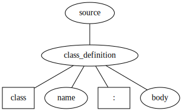

# Godot GDScript Formatter

A fast code formatter for Godot's GDScript programming language built with [Tree Sitter GDScript](https://github.com/PrestonKnopp/tree-sitter-gdscript) and [Topiary](https://topiary.tweag.io/).

The goal of this project is to provide a simple and fast GDScript code formatter that's easy to iterate on and contribute to while we wait for an official one to be integrated into the Godot game engine.

*You can learn more about the motivation behind this project in the [Motivation section](#motivation) below.*

## Status

Ready for daily use for commonly written code - 09/04/2025 - The formatter now has many formatting rules implemented and is ready to test. It includes:

- **Spaces**: leaving one space consistently between many operators, most keywords, or after commas in function calls, arrays, and dictionaries
- **Multi-line structures**: simple arrays and dictionaries can be wrapped on one or multiple lines with indentation
- **Indentation**: consistent indentation for blocks, function definitions, and control structures with configurable indent types (tabs or spaces)
- **Vertical spacing**: proper blank lines between functions, classes, and other major code structures

And more!

**Please report any issues you find with code snippets!** GDScript has grown into a complex language with many different syntax patterns. While the formatter covers many common cases, there can always be edge cases or less common syntax that may not be handled correctly yet. You can find known issues in the [GitHub issues section](issues).

### Formatting on single or multiple lines

The formatter's technology doesn't handle maximum line length automatically. Instead, for wrapping code on a single or multiple lines, it uses cues from you, the developer. For example, if you write an array on a single line, it will remain on a single line. This input:

```gdscript
var numbers: Array[int] = [1,2,3,4,5]
```

Will be formatted like this:

```gdscript
var numbers: Array[int] = [1, 2, 3, 4, 5]
```

If you insert a line return, the array will wrap on multiple lines instead. This input:

```gdscript
var dialogue_items: Array[String] = ["I'm learning about Arrays...",
	"...and it is a little bit complicated.", "Let's see if I got it right: an array is a list of values!", "Did I get it right? Did I?", "Hehe! Bye bye~!"]
```

Will be formatted like this:

```gdscript
var dialogue_items: Array[String] = [
	"I'm learning about Arrays...",
	"...and it is a little bit complicated.",
	"Let's see if I got it right: an array is a list of values!",
	"Did I get it right? Did I?",
	"Hehe! Bye bye~!"
]
```

You can insert the line returns anywhere in the array, and the formatter will keep it on multiple lines. The same applies to other structures.

## Contributing

Contributions are welcome! I've compiled some guides and guidelines below to help you get started with contributing to the GDScript formatter. If you need more information or want to discuss ideas for the formatter, please get in touch on the [GDQuest Discord](https://discord.gg/87NNb3Z).

### Adding new formatting rules

To add new formatting rules to the GDScript formatter, you can follow these steps:

1. **Add test cases with real-world GDScript code**: To add a test case, create input/expected file pairs in `tests/input/` and `tests/expected/` respectively. For example, if you want to test a new rule for function definitions, create `tests/input/function_definition.gd` and `tests/expected/function_definition.gd`:
   - The input file contains the GDScript code before running the formatter
   - The expected file contains the GDScript code after applying the new formatting rules
2. **Run tests**: Use `cargo test` to run the formatter on every input/expected file pair in the `tests/` directory. This will check if the formatter produces the expected output for each of them
3. **Update queries**: Modify `queries/gdscript.scm` with the formatting rules. This is the file that defines how the formatter should format GDScript code. You can use the existing rules as a reference for writing new ones (and the topiary documentation links below for more details)

### Development resources

- **[Tree-sitter Query Syntax](https://tree-sitter.github.io/tree-sitter/using-parsers/queries/1-syntax.html)**: Reference for writing tree-sitter queries - it's essential to understand how to write queries for formatting
- **[Topiary Documentation](https://topiary.tweag.io/book/)**: Complete guide to query syntax and formatting
- **[GDScript Style Guide](https://docs.godotengine.org/en/stable/tutorials/scripting/gdscript/gdscript_styleguide.html)**: Official Godot style guidelines

**Important**: we will likely not be able to implement all the guidelines from the official style guide with this formatter. What we gain in ease of implementation and maintenance, we lose in flexibility and advanced patterns.

## Project structure

Here are the most important directories and files in the project:

- `src/`: Contains the Rust code to compile and run the formatter using the CLI. It's currently a simple wrapper around the Topiary command line program, but later it could use Topiary as a library instead to pack everything into a simple binary.
- `tests/`: Contains test files for the formatter. It has input files with unformatted GDScript code and expected output files that the formatter should produce when run on the input files.
- `queries/`: Contains the Topiary formatting rules for GDScript. The `gdscript.scm` file is where you define how GDScript code should be formatted based on Tree Sitter queries and Topiary features to mark nodes/patterns for formatting.
- `config/`: Contains configuration files for Topiary - basically a small file that tells Topiary how to run the formatter for GDScript.
- `docs/`: This folder will compile images and recaps or cheat sheets with some tricks to help when working with Tree Sitter queries and Topiary.

## Installing and running the formatter

Install Topiary's command line tool: https://topiary.tweag.io/book/getting-started/installation/index.html

Build the formatter as a program (requires the Rust language compiler, the Rust language build system `cargo`, and Topiary to be installed):

```bash
cargo build
```

Format a file:

```
cargo run -- path/to/file.gd
```

Format with check mode, to use in a build system (exit code 1 if changes needed):

```bash
cargo run -- --check path/to/file.gd
```

### Development workflow

To test formatting on a simple code snippet, you can use `echo` or `cat` to pass GDScript code into the Topiary formatter. This is useful for quick tests since the output is directly printed to the console.

```bash
echo 'var x=1+2' | TOPIARY_LANGUAGE_DIR=queries topiary format --language gdscript --configuration config/languages.ncl
```

Running the formatter on a file is also supported, but note that it overwrites the file in place:

```bash
TOPIARY_LANGUAGE_DIR=queries topiary format --configuration config/languages.ncl -- test.gd
```

If you get an error that the idempotence check failed, it means that running the formatter a second time changed the already formatted file, which should ideally not happen. When iterating over a new feature, this is okay - you can first implement the feature, then run the formatter, and finally fix the idempotence issue.

You can use the `--skip-idempotence` flag to skip this check temporarily while developing new features:

```bash
TOPIARY_LANGUAGE_DIR=queries topiary format --configuration config/languages.ncl --skip-idempotence -- test.gd
```

### Running tests

To run the formatter's test suite, use this command:

```bash
cargo test
```

### Debugging and visualizing the tree structure

To visualize the graph structure that Topiary uses for formatting, you can use the `topiary visualise` command. It produces markup that you can pass to the open source program [Graphviz](https://graphviz.org/) to generate a visual representation of the abstract syntax tree (AST) used by Topiary.

This command generates the markup:

```bash
echo 'class Test:' | TOPIARY_LANGUAGE_DIR=queries topiary visualise --language gdscript --configuration config/languages.ncl
```

You can pipe the output to Graphviz's `dot` command to generate a vector image:

```bash
echo 'class Test:' | TOPIARY_LANGUAGE_DIR=queries topiary visualise --language gdscript --configuration config/languages.ncl | dot -Tsvg > image.svg
```

It will produce an SVG image like this:



You can also use tree-sitter directly to parse GDScript files and visualize the concrete syntax tree. This shows you the raw structure that the tree-sitter parser generates, which you can then use to write formatting rules in Topiary:

```bash
tree-sitter parse --scope source.gdscript test.gd
```

This requires setting up tree-sitter on your computer and having the GDScript parser configured.

When you're getting started with contributing to the formatter, I recommend beginning with the tree visualization commands.

For example, if you want to add a formatting rule for function definitions, you'd first use these commands to see how the parser represents functions in the tree. Then you can write queries that target those specific nodes and apply formatting rules to them in `queries/gdscript.scm`.

## License

MIT

## Motivation

Having an official GDScript formatter has been planned since the early days of Godot, but it has always been part of the engine's development backlog. It's a tool Godot users would use daily, so in 2022, we set out to sponsor the development of an [official GDScript formatter](https://github.com/godotengine/godot/pull/76211) built into Godot 4.

A lot of work went into this project from GDQuest. Then, following the suggestion to chop up the work into small chunks, a dedicated contributor, Scony, took over the project and tried breaking down the implementation [into small chunks](https://github.com/godotengine/godot/pull/97383) to make it much easier to review and merge. However, there isn't an active maintainer to review and merge the work, and the project has been stalled for a while now. The process is looking to take a long time, and we need solutions we can iterate upon quickly and use today.

Scony has been maintaining a solid set of community tools for GDScript, including a code formatter written in Python: [Godot GDScript Toolkit](https://github.com/Scony/godot-gdscript-toolkit). It's a great project that has been used by many Godot developers. So, why start another one?

The main motivation to experiment with this project is that the ruleset of Scony's formatter has grown quite advanced over the years, and it has limitations for us at GDQuest that make it not work for our projects. Some of these limitations are also not easy to overcome.

Since Scony made his great formatter, new technologies have emerged that make it much easier to implement and maintain one. Thanks to Tree Sitter and Topiary, in just a couple of hours, you can now kickstart a code formatter that can be compiled to native code and used in any code editor or IDE.

**Tree-sitter** is a powerful parser generator that makes it easy to create programming language parsers that run natively (it generates C code). It gives you a simple query language to detect patterns in the code and process them, a bit like CSS selectors (but simpler and more restricted). It's used in modern code editors for syntax highlighting, code navigation, outline, folding, and more (Zed, Neovim, Emacs, Helix, Lapce...).

**Topiary** is a Rust library and command line program that makes it easy to implement a code formatter using a parser based on Tree Sitter. You use the Tree Sitter query language to define how the code should be formatted, and Topiary takes care of the rest.
